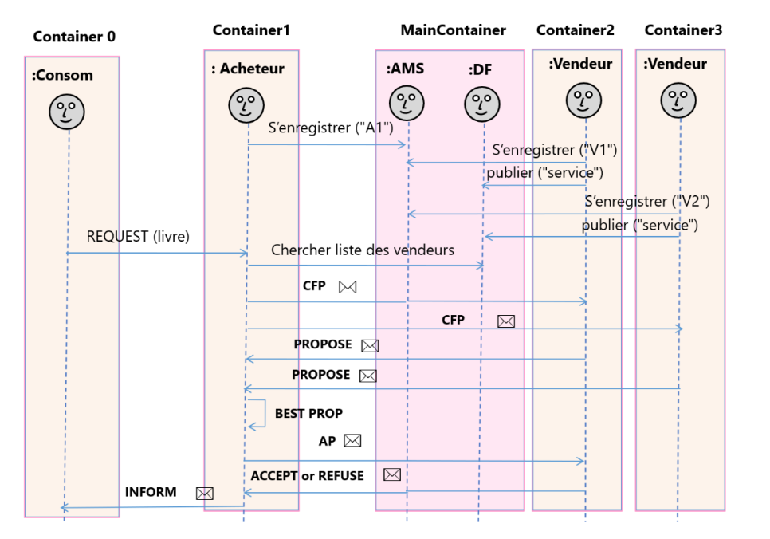
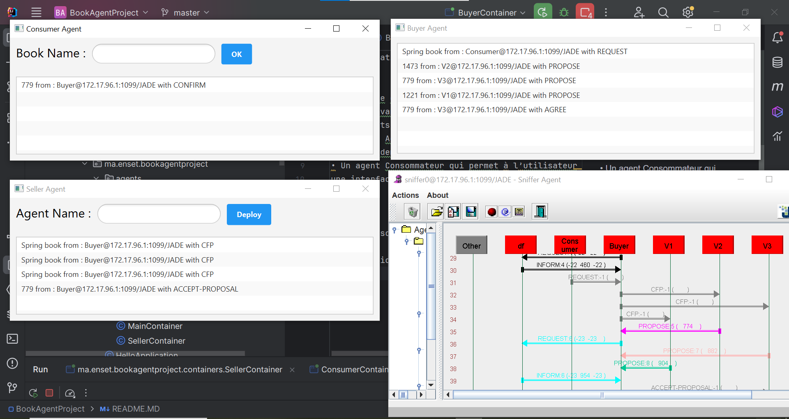

<h1>Application Multi Agents :Book Agent </h1>

On souhaite créer une application Multi Agents en utilisant la plateforme JADE qui se compose des
agents suivants :  
• Des agents Vendeurs qui offre des services de vente de livres 
• Un Agent Acheteur qui s’occupe de négocier l’achat d’un livre en cherchant l’offre la moins 
cher à la demande d’un agent consommateur. 
• Un agent Consommateur qui permet à l’utilisateur de saisir le titre du livre à acheter dans  
une interface graphique et qui demande à l’agent acheteur d’effectuer l’achat de ce livre  

<h2>Exécution : </h2>

